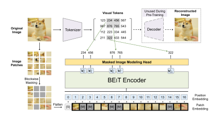
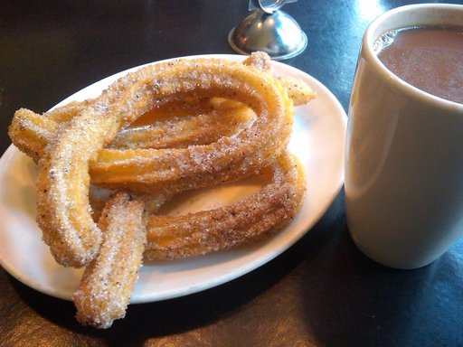
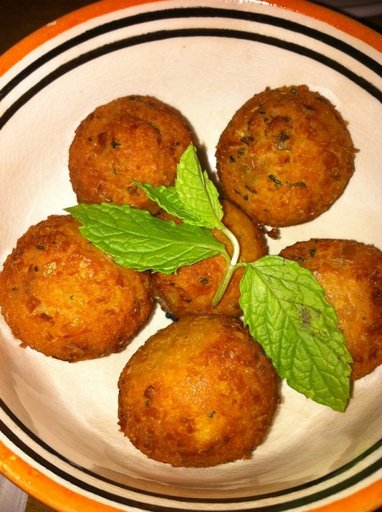
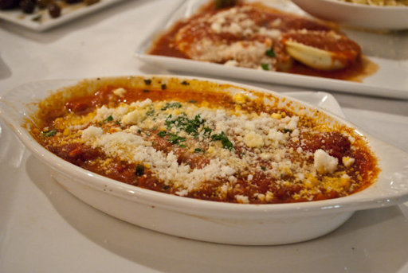

## BEiT Image Transformer for Food Classification

Application for fine-tuning [Microsoft's BEiT](https://arxiv.org/abs/2106.08254) model (_Bidirectional Encoder representation from Image Transformers_) on an image classification dataset (Food 101). 

### Models

BEiT is a family of Image Transformers that during its pre-training first tokenizes images into discrete visual tokens, randomly corrupts these tokens using blockwise masking and then learns to predict the best visual tokens to fill the gaps. In this sense, it utilizes a 'BERT-like' approach for its pre-training. 

|                                                      | 
|:-----------------------------------------------------------------------------------------------------------:| 
| *BEiT pre-training procedure (image taken from [the original paper](https://arxiv.org/abs/2106.08254))* |

 

Three variants of the model are fine-tuned and evaluated:

|                                               model_id                                                |                        pre-trained on                         |                      further fine-tuned on                      |
|:-----------------------------------------------------------------------------------------------------:|:-------------------------------------------------------------:|:---------------------------------------------------------------:|
| [microsoft/beit-base-patch16-224-pt22k](https://huggingface.co/microsoft/beit-base-patch16-224-pt22k) | ImageNet-21k (14m images, 21k classes, at resolution 224x224) |                                -                                | 
|  [microsoft/beit-base-patch16-224](https://huggingface.co/microsoft/microsoft/beit-base-patch16-224)  | ImageNet-21k (14m images, 21k classes, at resolution 224x224) |  ImageNet 2012 (1m images, 1k classes, at resolution 224x224)   | 
|      [microsoft/beit-base-patch16-224-pt22k-ft22k](https://huggingface.co/microsoft/microsoft/microsoft/beit-base-patch16-224-pt22k-ft22k)       | ImageNet-21k (14m images, 21k classes, at resolution 224x224) | ImageNet-21k (14m images, 21k classes, at resolution 224x224)   | 

In all pre-trainings, the images were handed to the model in patches of size 16x16. Each model has a size of about 86m parameters. 

 

### Corpus

The [**Food 101**](https://www.kaggle.com/datasets/dansbecker/food-101) corpus contains 101.000 images of 101 types of food originally posted on the _foodspotting.com_ platform. Some examples are shown below.  

| Type of food |                              Image                              | 
|:------------:|:---------------------------------------------------------------:| 
|   Churros    |  |
|   Falafel    |  |
|    Sushi     |      |
|   Lasagna    |  |

The corpus was split into 80% train, 10% validation and 10% test set. Each model variant was fine-tuned for three epochs on the data. 

 

### Results

|                Model                | Accuracy |
|:-----------------------------------:|:--------:|
|     beit-base-patch16-224-pt22k     |  0.629   |
|        beit-base-patch16-224        |  0.825   |
| beit-base-patch16-224-pt22k-ft22k   |  0.811   |

 

### Requirements

##### - Python >= 3.10

##### - Conda
  - `pytorch==2.4.0`
  - `cudatoolkit=12.1`

##### - pip
  - `transformers`
  - `datasets`
  - `openpyxl`
  - `scikit-learn`

 

### Notes

The dataset image files are not included, they can be downloaded from [this Kaggle URL](https://www.kaggle.com/datasets/dansbecker/food-101).
The trained model files are omitted in this repository.
